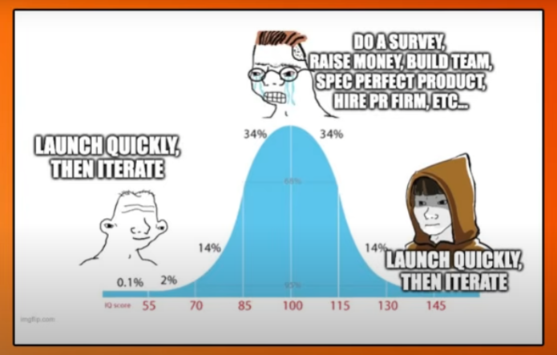

# Ideas that lots of people try and then it fails 

https://www.youtube.com/watch?v=GMIawSAygO4&ab_channel=YCombinator

Most of the tarpit idea tend to be consumer idea - ideas for individuals (something cool) somethign marketed to 

1. Things we here about is consumer successes - thus its natural to think about consumer app idea
   1. i.e., need to go non-consumer route search comapany problems

1. How high the bar is in consumer bussiness - its really high actually the consumer products
2. The effect of timing is actually huge
3. Consumer idea usually are 'so good' people tend to need or want without doing any marketing

**The current landascape is probably AI and stronger consumer computers**

1. Facebook timing was perfect because there was nothing esle to do - poking, liking and comments etc.,
2. Smart phone era: Could make some basic stuff and get alot of users

e.g., 
App that discovers new thigns - machine learning reccomendations etc., ..
The reality is that the magic place for reccomendation doesn't exist... there are limited number of restraunts that exist 

Relize easy idea that look good - could be a tarpit idea

## Supply and demand

1. Many startup ideas that have many founders that want to work on it
   1. Organizing concerts
2. Startup ideas that are hard to start with or the skill set is missing
   1. e.g., Open source developer orchestration tools
   2. Quatum Computer startup

Find a new space or a boring space? That requires differentiated skills or a 'niche'

Software for connection i.e., define a certain tool that can define connection rules :  Connect or something make a webtool that can create onnection - 4G/LTE different devices radios and servers etc., SP6 SIP interface and organize visually; Customizable

# Schlep Blindness 
Reading paul grahams notes here https://paulgraham.com/schlep.html

1. You can't start a startup by just writing code
2. Schlep means something tedious or unpleasant
3. Some startup ideas are schleps such as Stripe (payment processing is hard to get right) - Instead people built event aggregators or recipe sites..
4. The complex idea is the too hard might be an avenue - sometimes the best antidote to schlep is

**ignorance**