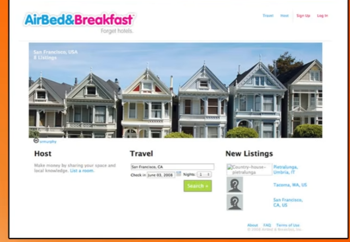
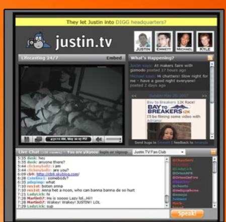
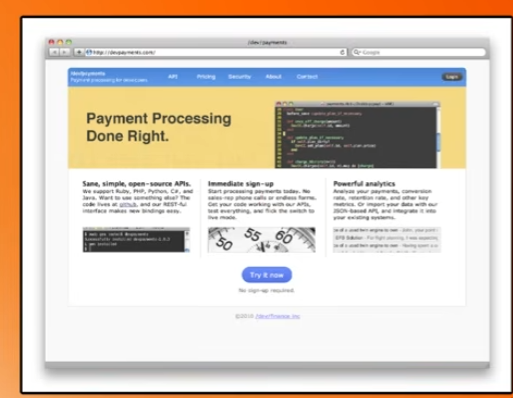

# How to build a MVP
[how to build a mvp](https://www.ycombinator.com/library/Io-how-to-build-an-mvp)
1. Build a minimum product
2. Talk to customers
3. Get feedback and continue to iterate

Usually the first people are early adopters

People who run away after from an incompolete product is people who wouldn't anyways

**getting over fear**

Two types of fears:

1. Overengineering:
Usually people who over-engineer they are afraid the first customer won't like it and scared of release

2. Thinking knowing exactly what customer needs: 
the 'fake steve jobs' person who 'knows' the perfect product and will not release the product before some time

### Examples of MVP
- Fast to build
- Limited functionality
- Appealed to small set of users

1. Air BnB initially had
   1. No payments - needed to arrange physically
   2. No map view - couldn't see where it was in the world
   3. Only worked for conferences
   

1. Justin.tv
   1. Broadcast a person 24/7
   2. Single person, low res and streaming was expensive

1. Stripe 
   1. No bank deals (just a tiny bank)
   2. No direct API with bank needed to file manually with paperwork
   3. No features (even twitch cou;dn't use it)
   4. There was a small subset of folks who could use it 

### Who are the people who wants to use crappy MVPS?
- Build for users who have their hair is on fire..!!!
- But some-guy has a brick to solve the problem
- The desperate guy will use the brick 

Also surveying the users. why not just ask them... this is a fallacy they have their problems but they do not have the **answer** to their problems.. you do, the mvp..

Building a startup before product market fit is just **learning** after launch

The fastest way to start is builiding a MVP

Tips and tricks to building a MVP
1. Timebox your spec - 2 weeks or 1 month 
2. Write the spec - which features are required